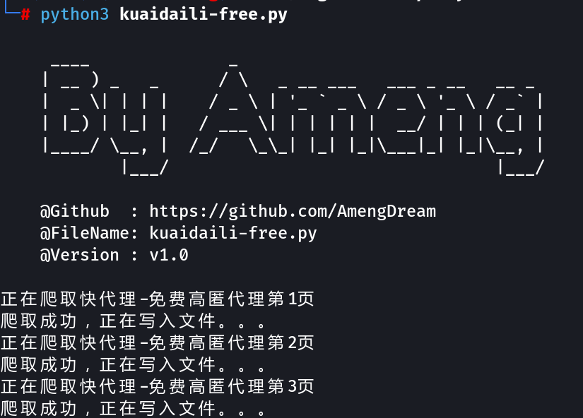
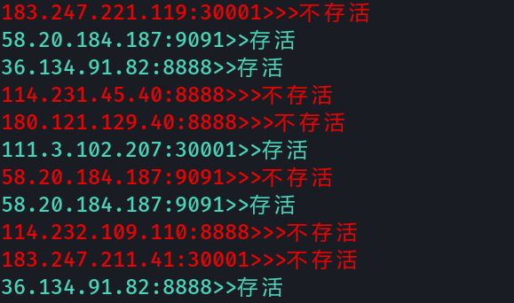

# Proxy-Crawl
爬取快代理的免费代理，并检测代理存活

## 使用方法：           

首先运行

```
python3 kuaidaili-free.py
```



运行完成会在当前目录下生成`proxy_kdl.txt`

然后执行

```
python3 ProxyHealth.py
```



运行完成后会在当前目录下生成`alive_proxy.txt`用来保存存活的代理

## Tips：

1.因为爬取的时候快代理的数据本身存在重复，所以最后的结果需要去重。

2.为什么不写成一个文件？问就是不会，能跑就行了呗。

3.免费的代理质量并不要，条件允许还是建议购买商业代理。
